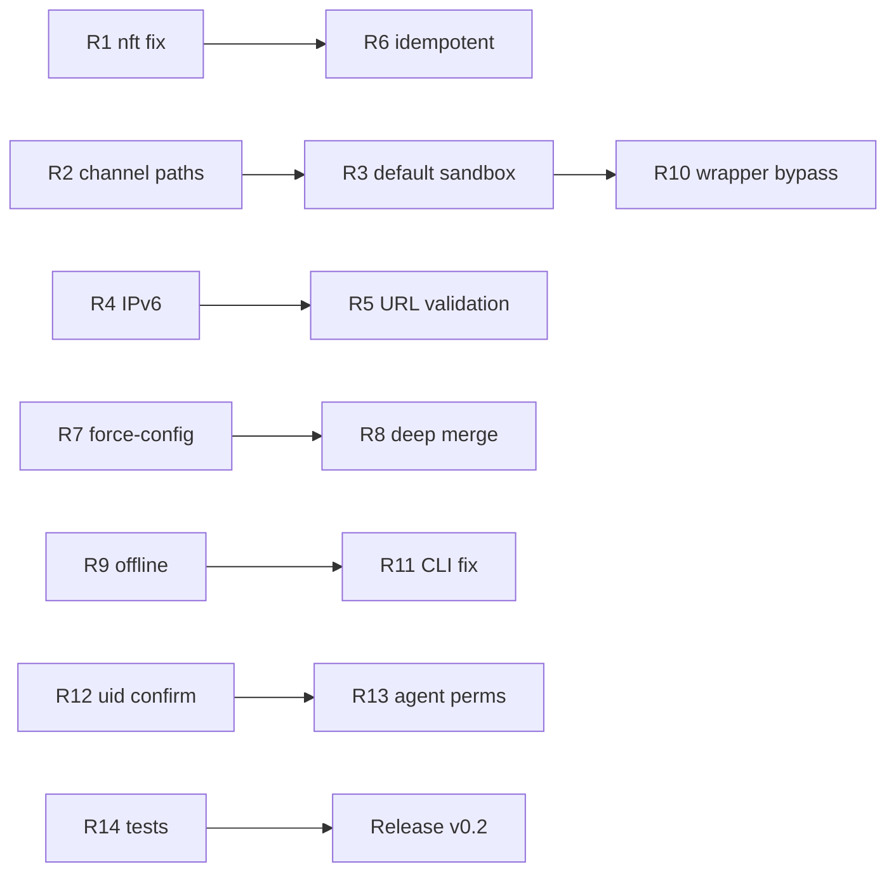

# План доработок: Zed Secure Install Script

Документ основан на code review реализации [`scripts/install-zed-secure.sh`](../scripts/install-zed-secure.sh) и сравнении с исходным implementation plan.

**Цель доработок:** устранить security/functional gaps, чтобы installer соответствовал заявленному threat model для работы с проприетарным кодом и локальным OpenAI-compatible LLM.

---

## Приоритеты

| Приоритет | ID | Задача | Риск если не исправить |
|-----------|----|--------|------------------------|
| P0 | R1 | Убрать глобальный nft output hook | Блокировка сети для всех процессов на хосте |
| P0 | R2 | Исправить пути бинаря для preview/nightly channel | Wrapper/desktop указывают на несуществующий бинарь |
| P1 | R3 | Включать network sandbox по умолчанию для local-AI | Cloud egress остаётся возможным без явного флага |
| P1 | R4 | Исправить валидацию IPv6 loopback URL | Ложный reject `http://[::1]:...` |
| P1 | R5 | Расширить валидацию URL (query/path) | Валидные LLM endpoints отклоняются |
| P1 | R6 | Сделать nft blocklist идempotent | Повторный install падает на `set -eu` |
| P2 | R7 | Починить или убрать `--force-config` | Вводящий в заблуждение CLI |
| P2 | R8 | Deep merge для `--merge-config` | Частично сохраняются небезопасные настройки |
| P2 | R9 | Offline install через `ZED_BUNDLE_PATH` | Лишний network fetch в air-gapped среде |
| P2 | R10 | Защита от обхода wrapper | Прямой запуск `zed` минует sandbox и unset keys |
| P2 | R11 | `--disable-endpoint-blocklist` без побочного reinstall | Неожиданное поведение CLI |
| P3 | R12 | Предупреждение/confirm для `--uid-wide-strict-firewall` | Случайная блокировка всего egress UID |
| P3 | R13 | `agent.tool_permissions` и при `--disable-ai` | Слабее defense-in-depth при последующем включении AI |
| P3 | R14 | Автотесты installer | Регрессии не ловятся до ручной проверки |

---

## P0 — Critical

### R1. Убрать глобальный nft output hook

**Проблема:** `apply_nft_blocklist()` создаёт chain `inet zed_privacy output` без привязки к процессу Zed. Правило `ip daddr @blocked drop` влияет на **весь** исходящий трафик системы.

**Файл:** `scripts/install-zed-secure.sh` — функция `apply_nft_blocklist()`

**План:**

1. Удалить глобальный `output` hook из default path.
2. Оставить `/etc/hosts` blocklist как единственный system-wide best-effort механизм (с явным warning в README).
3. Альтернатива (если nft всё же нужен): ограничить правила `meta skuid $(id -u)` **только** при явном `--uid-wide-strict-firewall`, не смешивать с endpoint blocklist.
4. Обновить README: endpoint blocklist ≠ process isolation; основная защита — `systemd-run` sandbox.

**Критерии приёмки:**

- [ ] Повторный `--enable-endpoint-blocklist` не создаёт global output drop rules
- [ ] `curl https://api.openai.com` из другого терминала работает при включённом endpoint blocklist (hosts-only mode)
- [ ] Summary явно пишет, что nft global rules не применяются

---

### R2. Пути бинаря для preview/nightly/dev channel

**Проблема:** `ZED_APP_BIN` захардкожен как `$HOME/.local/zed.app/bin/zed`. Официальный install script для `preview` ставит в `zed-preview.app`, для других channel — свой suffix.

**Файл:** `scripts/install-zed-secure.sh`

**План:**

1. Добавить `resolve_zed_app_paths()` после install:
   - `stable` → `~/.local/zed.app`
   - `preview` → `~/.local/zed-preview.app`
   - `nightly` → `~/.local/zed-nightly.app`
   - `dev` → `~/.local/zed-dev.app`
2. Вычислять `ZED_APP_BIN` динамически от channel.
3. Патчить `.desktop` file с учётом channel-specific app id (`dev.zed.Zed-Preview` и т.д.).
4. Wrapper должен embed актуальный путь после install.

**Критерии приёмки:**

- [x] `--channel preview --dry-run` показывает корректный путь к бинарю
- [x] `zed-secure --version` работает после install preview channel
- [x] Desktop entry для preview channel патчится на `zed-secure`

---

## P1 — High

### R3. Network sandbox по умолчанию для local-AI режима

**Проблема:** При установке с `--llm-model` без `--enable-network-sandbox` wrapper создаётся с `ZED_SECURE_NETWORK_SANDBOX=0`. Это не соответствует threat model «проприетарный код + local LLM».

**План:**

1. Если `--llm-model` задан и `--disable-ai` не передан → включать `ENABLE_NETWORK_SANDBOX=1` по умолчанию.
2. Добавить явный opt-out: `--no-network-sandbox` (с большим warning).
3. Обновить README и summary: local-AI install always recommends sandbox.
4. Если sandbox недоступен → fail, если не передан `--allow-no-sandbox`.

**Критерии приёмки:**

- [x] `./install-zed-secure.sh --llm-model foo` включает sandbox без доп. флага
- [x] `./install-zed-secure.sh --llm-model foo --no-network-sandbox` печатает warning
- [x] `./install-zed-secure.sh --disable-ai` не включает sandbox по умолчанию

---

### R4. IPv6 loopback URL validation

**Проблема:** В `is_loopback_url()` pattern `http://[::1]:*` в `case` интерпретируется как character class, не literal IPv6. URL `http://[::1]:8080/v1` отклоняется.

**План:**

1. Заменить `case` на явные prefix checks через `printf`/`sed` или отдельные `case` без `[`:
   ```sh
   # Пример: проверка prefix
   case "$url" in
     http://\[::1\]:*|http://\[::1\]|http://\[::1\]/*) ...
   ```
   В POSIX sh экранировать `[` в pattern сложно — предпочтительнее:
   ```sh
   case "$url" in
     http://127.0.0.1:*|http://127.0.0.1|http://127.0.0.1/*) ...
   esac
   # Отдельно:
   case "$url" in
     http://\[::1\]:*) ...
   esac
   ```
   Или нормализовать URL перед проверкой (strip port, compare host part).
2. Добавить тест-кейсы для `::1`, `127.0.0.1`, `localhost`.

**Критерии приёмки:**

- [ ] `http://[::1]:8080/v1` принимается без `--allow-nonlocal-llm`
- [ ] `http://192.168.1.1:8080/v1` отклоняется

---

### R5. Валидация URL с query/path

**Проблема:** `validate_json_string()` не допускает `?`, `&`, `%` — валидные OpenAI-compatible URL с query params отвергаются.

**План:**

1. Разделить валидацию:
   - `validate_model_name()` — строгий alnum set
   - `validate_provider_name()` — alnum + пробелы запрещены
   - `validate_url()` — разрешить `?&=%` + проверка scheme/host
2. Для URL дополнительно парсить host и проверять loopback через `is_loopback_host()`.

**Критерии приёмки:**

- [ ] `http://127.0.0.1:8080/v1?api_version=2024` принимается
- [ ] `http://evil.com/v1` отклоняется без `--allow-nonlocal-llm`

---

### R6. Idempotent nft blocklist

**Проблема:** Скрипт nft начинается с `add table`, который падает если table уже существует. При `set -eu` install abort.

**План:**

1. Изменить порядок: `delete table inet zed_privacy` (ignore error) → `add table`.
2. Или использовать `nft list table inet zed_privacy >/dev/null 2>&1 || nft add table ...`.
3. Добавить `--enable-endpoint-blocklist` dry-run + repeat install test.

**Критерии приёмки:**

- [ ] Два последовательных install с `--enable-endpoint-blocklist` завершаются exit 0

---

## P2 — Medium

### R7. `--force-config` semantics

**Проблема:** Флаг не меняет поведение — backup + overwrite происходит в обеих ветках.

**План (выбрать один вариант):**

- **A:** `--force-config` = overwrite без backup (опасно, но явно)
- **B:** `--force-config` = overwrite с backup (текущее поведение), убрать флаг из CLI
- **C:** `--force-config` = skip prompt (если добавить interactive confirm по умолчанию)

**Рекомендация:** вариант B — убрать флаг, оставить backup always; документировать в README.

---

### R8. Deep merge для `--merge-config`

**Проблема:** `jq -s 'add'` делает shallow merge; nested keys (`telemetry`, `title_bar`) могут merge некорректно.

**План:**

1. Заменить на `jq -s '.[0] * .[1]'` (one-level deep) или `.[0] * .[1] | ...` с explicit deep merge для known keys.
2. Для security-critical keys (`telemetry`, `disable_ai`, `auto_update`) — always overwrite from template, never preserve old values.

**Критерии приёмки:**

- [ ] Merge не оставляет `telemetry.metrics: true` из старого конфига

---

### R9. Offline install через `ZED_BUNDLE_PATH`

**Проблема:** Даже с локальным tarball скрипт делает `curl https://zed.dev/install.sh`.

**План:**

1. Если `ZED_BUNDLE_PATH` задан:
   - Скачивать/использовать локальный `install.sh` из repo или embed minimal install logic (tar extract + symlink + desktop) без network.
2. Добавить `--offline` flag: fail если нужен network fetch.
3. Документировать air-gapped workflow в README.

---

### R10. Защита от обхода wrapper

**Проблема:** Пользователь может запустить `~/.local/zed.app/bin/zed` напрямую.

**План:**

1. Опционально: symlink `~/.local/bin/zed` → `zed-secure` (с backup оригинала).
2. Или: wrapper script + warning при install если `zed` в PATH не является `zed-secure`.
3. README: явно писать «не используйте `zed` напрямую».

**Критерии приёмки:**

- [ ] После install `which zed` указывает на `zed-secure` (если включён opt-in `--replace-zed-cli`)

---

### R11. `--disable-endpoint-blocklist` без reinstall

**Проблема:** Комбинация `--disable-endpoint-blocklist --disable-ai` запускает полный install.

**План:**

1. Если передан **только** `--disable-endpoint-blocklist` (без других action flags) → remove blocklist и exit 0.
2. Определить «action flags»: `--install-deps`, `--llm-model`, `--disable-ai`, `--enable-*`, `--channel`, `--version`, `--uninstall`.

**Критерии приёмки:**

- [ ] `./install-zed-secure.sh --disable-endpoint-blocklist` не трогает settings/wrapper

---

## P3 — Low / Hardening

### R12. Confirm для `--uid-wide-strict-firewall`

**План:**

1. Требовать `--i-accept-uid-wide-firewall` в дополнение к флагу.
2. Большой warning + 5-секундная пауза (или `--yes`).
3. README: отдельная секция «Dangerous options».

---

### R13. Agent tool permissions при `--disable-ai`

**План:**

1. Всегда писать `agent.tool_permissions` с deny для `fetch`/`search_web`, даже при `disable_ai: true`.
2. Defense-in-depth если пользователь позже включит AI через UI.

---

### R14. Автотесты

**Структура:**

```
tests/
  test_json_generation.sh      # settings output → jq empty
  test_url_validation.sh       # loopback / reject cases
  test_channel_paths.sh        # stable vs preview binary paths
  test_cli_parser.sh           # unknown flags, required args
  test_dry_run.sh              # no writes to /etc/hosts, settings
```

**Runner:** POSIX sh, без external deps кроме `jq` (optional).

**CI:** GitHub Actions job `sh -n`, run tests, optional shellcheck.

**Критерии приёмки:**

- [ ] `make test` или `./tests/run.sh` проходит локально
- [ ] Минимум 10 test cases для URL validation и JSON generation

---

## Порядок реализации (рекомендуемый)



**Фазы:**

| Фаза | Задачи | Оценка |
|------|--------|--------|
| **1. Security hotfix** | R1, R6 | 2–3 ч |
| **2. Functional fixes** | R2, R4, R5, R11 | 3–4 ч |
| **3. Threat model alignment** | R3, R10, R13 | 2–3 ч |
| **4. CLI/UX cleanup** | R7, R8, R9, R12 | 2–3 ч |
| **5. Quality** | R14 + README update | 4–6 ч |

---

## Изменения в документации

После каждой фазы обновлять [`README.md`](../README.md):

1. **Threat model table** — уточнить scope nft vs hosts vs sandbox
2. **Default behavior** — sandbox on by default для local-AI
3. **Dangerous flags** — `--uid-wide-strict-firewall`, `--allow-nonlocal-llm`
4. **Offline install** — после R9
5. **Channel support** — stable/preview/nightly paths

---

## Out of scope (осознанно не трогаем)

- Установка LLM-сервера (llama.cpp, vLLM, LM Studio)
- Flatpak/Snap sandboxing
- Zed Business org policies
- Checksum verification официального install.sh (наследуем риск upstream)
- Очистка OS keychain от cloud API keys

---

## Связанные файлы

| Файл | Роль |
|------|------|
| [`scripts/install-zed-secure.sh`](../scripts/install-zed-secure.sh) | Основной installer |
| [`README.md`](../README.md) | User-facing docs |
| `tests/*.sh` | Будущие автотесты (R14) |

---

*Создано по результатам code review. Версия плана: 1.0.*
